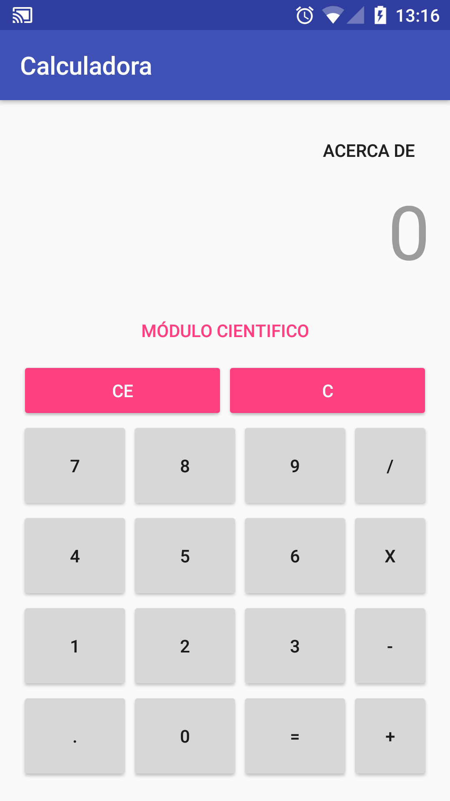
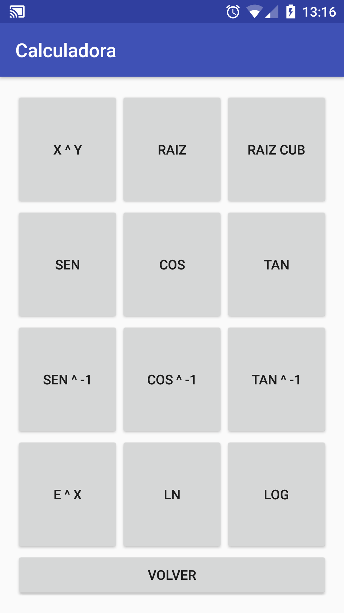

# Calculadora
App de calculadora básica en Android

Aplicación de calculadora básica hecha en Android (con Android Studio 2.2.3) con las 4 operaciones básicas (suma, resta, multiplicación y división). Además tiene un modulo con más operaciones como raices, logaritmos o senos y cosenos. 

  
  

## Autor

* **Luis Cambero** - [lcambero](https://github.com/lcambero)

## Última actualización

15 de Diciembre de 2018

## License

This project is licensed under the MIT License - see the [LICENSE](LICENSE) file for details.
